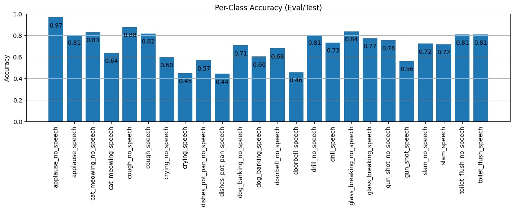

# SoundAware 


SoundAware is a mobile app built with Expo (React Native) using Expo Router. This README explains how to install dependencies, run the project, and use the app on a physical mobile device on the same Wi‑Fi/LAN as your laptop so the LAN IP is reachable.


## Features (Overview)
- Chatbot and history UI (`app/(tabs)/chatbot.tsx`, `app/(tabs)/history.tsx`)
- Audio visualization components (`components/ui/AudioVisualizer.tsx`)
- Multi-language infrastructure (`contexts/LanguageContext.tsx`, `i18n-js`)
- Expo modules such as `expo-av`, `expo-camera`, `expo-file-system`, `expo-speech`, `expo-haptics`, etc.
- Navigation via `expo-router` and `@react-navigation/*`


Important config files:
- `package.json` – scripts and dependencies
- `app.json` – Expo config (name, icon, plugins, web bundler, etc.)

## Audio Processing
- Used `Librosa`
- Raw audio signals were transformed into `Mel-spectrogram` images to capture meaningful time-frequency features.
- All audio clips were standardized to a 16 kHz sample rate for consistency across the dataset.
- Mel-spectrograms were computed using an `FFT` size of 1024 and a hop length of 512.
- A total of 64 Mel-frequency bands were extracted to create detailed, high-resolution spectrograms.
- The generated Mel-spectrograms were saved as `TIFF records`, which served as the input format for the neural network classification model.

## Model 
- Used `TensorFlow` (with `Keras` API)
- The dataset used in this project was sourced from [Zenodo](https://doi.org/10.5281/zenodo.10378145)
- The classification task includes 12 classes, and each class has two categories: speech and no speech.
- We experimented with multiple deep learning architectures, including:
  - CNN
  - CRNN
  - BC_ResNet-40
- Among all models, `BC_ResNet-40` achieved the best accuracy of 71.40%.
- Also applied `INT8` quantization to the model to make it compatible with mobile devices.




## Prerequisites
- Node.js LTS (>= 18 recommended)
- npm (bundled with Node) or yarn/pnpm (optional)
- Expo CLI (you can use `npx` without a global install)
- Android or iOS device:
  - Android: Expo Go app on a physical device (from Play Store) or an Android Emulator (Android Studio).
  - iOS: Expo Go on a physical device (App Store) or Xcode Simulator (macOS only).

Windows tips:
- Set up ADB/Emulator via Android Studio if needed (optional; Expo Go on a physical device is easiest).
- Allow Node/Expo through Windows Firewall on Private networks so the LAN dev server is reachable.


## Install
1. Install dependencies:
   ```bash
   npm install
   ```
2. Install all Python Libraries in the Backend
   ```bash
   pip install -r requirements.txt
   ```
2. If you’re behind a corporate proxy/VPN, ensure your `npm`/`git` proxy settings are correct.


## Run (Development)

1. $env:REACT_NATIVE_PACKAGER_HOSTNAME="xxx.xxx.xx.xx"

Replace xxx.xxx.xx.xx with your IP Address of the Devices.

2. record.tsx

const BACKEND_BASE = (global as any).BACKEND_URL || 'http://xxx.xxx.xx.xx:5000';

Replace xxx.xxx.xx.xx with your IP Address of the Devices.

3. index.js

global.BACKEND_URL = 'http://xx.xx.xx.xx:5000';

Replace xxx.xxx.xx.xx with your IP Address of the Devices.

Start the local development server:
```bash
npx expo start -c
```
This runs `expo start` and shows a QR code and connection options (LAN/Tunnel/Local).


## Run on a Mobile Device (Same Wi‑Fi/LAN Required)

Your mobile device and laptop must be on the same Wi‑Fi network. This ensures the Expo dev server’s LAN IP is reachable from your phone.

## Run (Backend)
```bash
.\start-backend.ps1
```
or 

Use Two Terminals 
1. Run
   ```bash
   cd backend
   ```
 And Run
   ```bash
   python app.py
   ```
2. Run
   ```bash
   .\start-backend.ps1
   ```

Backend: ffmpeg (required for mobile uploads)
Why ffmpeg?

Mobile/Expo recordings often arrive in containers (WebM / MP4 / M4A) that Python/librosa cannot decode directly.
The backend uses ffmpeg to convert uploaded audio to 16 kHz mono WAV before creating the mel spectrogram for the model.
If ffmpeg is not available to the backend process, non‑WAV uploads will fail and the server will return errors.

Quick summary: install ffmpeg once, then start the backend in a terminal that sees ffmpeg. Start Expo in a separate terminal.

1. Install ffmpeg
Windows — non-admin (recommended)

# User installation (downloads a static build and places bin in %USERPROFILE%\tools\ffmpeg)
```bash
a. $dest = Join-Path $env:USERPROFILE 'tools\ffmpeg'; New-Item -ItemType Directory -Path $dest -Force
```
```bash
b. $zip = Join-Path $env:TEMP 'ffmpeg.zip'
```
```bash
c. Invoke-WebRequest -Uri 'https://www.gyan.dev/ffmpeg/builds/ffmpeg-release-essentials.zip' -OutFile $zip
```
```bash
d. $extract = Join-Path $env:TEMP 'ffmpeg_extract'
```
```bash
e. Remove-Item -Recurse -Force $extract -ErrorAction SilentlyContinue
```
```bash
f. Expand-Archive -Path $zip -DestinationPath $extract -Force
```
```bash
g. $inner = Get-ChildItem -Path $extract -Directory | Select-Object -First 1
```
```bash
h. Copy-Item -Path (Join-Path $inner.FullName 'bin\*') -Destination $dest -Recurse -Force
```

# Add to user PATH for future sessions
```bash
i. $old = [Environment]::GetEnvironmentVariable('PATH','User'); [Environment]::SetEnvironmentVariable('PATH', "$dest;$old",'User')
```
# Make available in current shell immediately
```bash
j. $env:PATH = "$dest;$env:PATH"
```
```bash
h. ffmpeg -version
```

2. Restart backend so it can see ffmpeg

The running backend process inherits PATH from the shell that launched it. After installing or adding ffmpeg to PATH:

Open a new terminal (PowerShell / bash).

Confirm ffmpeg is visible:
```bash
a. ffmpeg -version
```
```bash
b. python -c "import shutil; print(shutil.which('ffmpeg'))"
```
Both should show a path and version.

3. Run both quickly (convenience)
   
We include start-backend.ps1 in the repo which ensures ffmpeg path is set for the spawned backend. Use it from repository root:
```bash
.\start-backend.ps1
```
Then in another terminal:
```bash
npx expo start -c
```
Steps:

1. Connect both devices to the same Wi‑Fi (same router SSID). Guest networks/hotspots may restrict LAN access.
2. After `npx expo start -c`, the Expo Dev Tools open. Keep the connection type as "LAN" (default). If LAN is blocked, allow through Firewall or temporarily switch to "Tunnel" (slower, uses internet).
3. Open Expo Go on your phone:
   - Android: Scan the QR code from the Dev Tools.
   - iOS: Use the Camera app to scan the QR and open in Expo Go.
4. The app will load automatically. Hot reload/Fast Refresh will be active.

Tips:
- If it fails after scanning the QR, the Dev Tools show a URL like `exp://<YOUR_LAPTOP_LAN_IP>:<PORT>`. Ensure `<YOUR_LAPTOP_LAN_IP>` is your laptop’s private IP (e.g., 192.168.x.x) and reachable on the same Wi‑Fi.
- When prompted by Windows Firewall, choose "Allow access" for Private networks.
- VPN/Firewall/Antivirus can block LAN traffic; temporarily disable or add allow rules if needed.


## Run on Web (Optional)
You can also test on the web:
- Dev server as web:
  ```bash
  npx expo start --web
  ```
- Static web export (production-like):
  ```bash
  npm run build:web
  ```
  The output will be in `dist/` (Expo export default output).


## Directory Structure (High-level)
- `app/` – Expo Router screens & layouts
  - `app/(tabs)/` – Tab-based routes (e.g., `chatbot.tsx`, `history.tsx`)
  - `_layout.tsx` – Root/tab layouts
- `assets/` – Images, icons, favicons
- `components/ui/` – Reusable UI components (Button, Card, AudioVisualizer, etc.)
- `contexts/` – React contexts (AI Assistant, Language, ML Model, Notification, etc.)
- `hooks/` – Custom hooks (e.g., `useFrameworkReady.ts`)
- `types/` – Shared TypeScript types
- `index.js`, `babel.config.js`, `tsconfig.json` – Project setup/config


## Useful Commands
```bash
# Start dev (default)
npm run dev

# Start web dev
npx expo start --web

# Clear Metro cache (fix common issues)
expo start -c

# Upgrade Expo SDK (interactive)
npx expo upgrade
```

